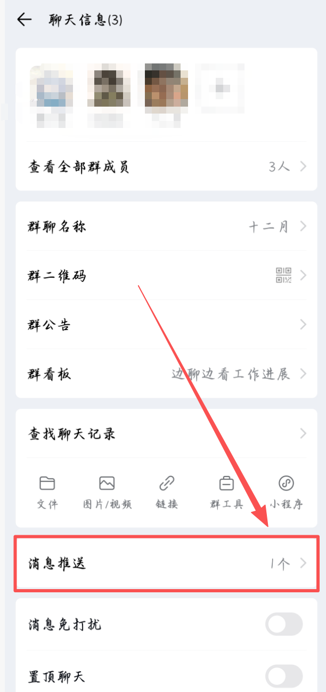
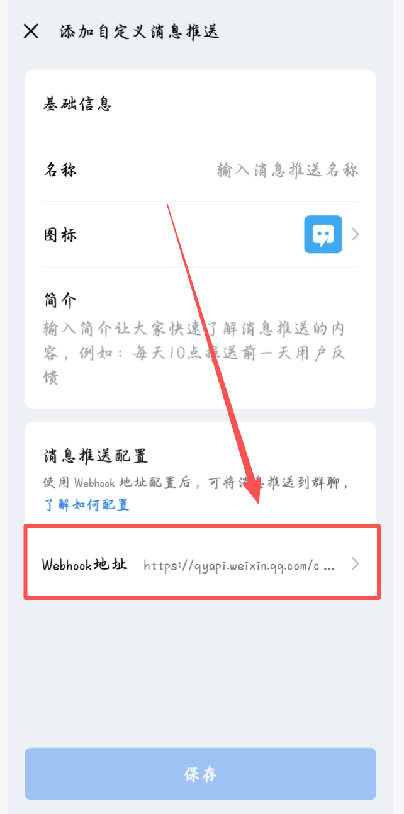
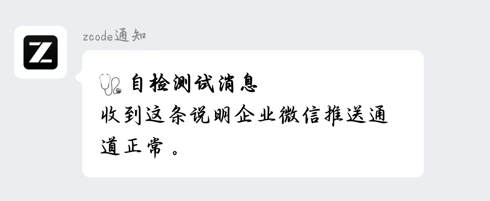
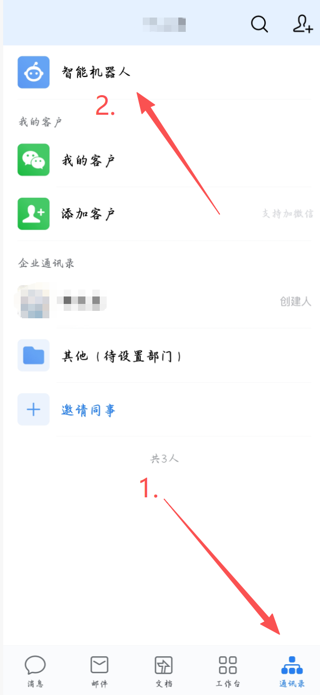
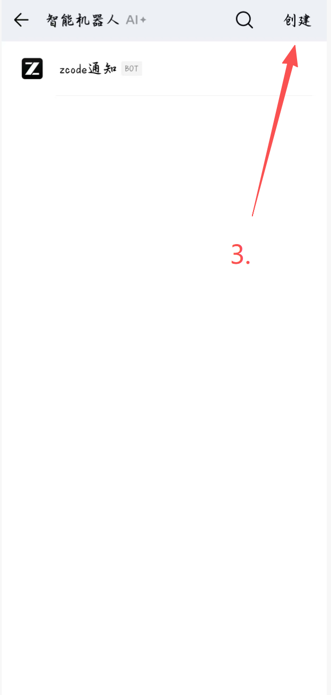
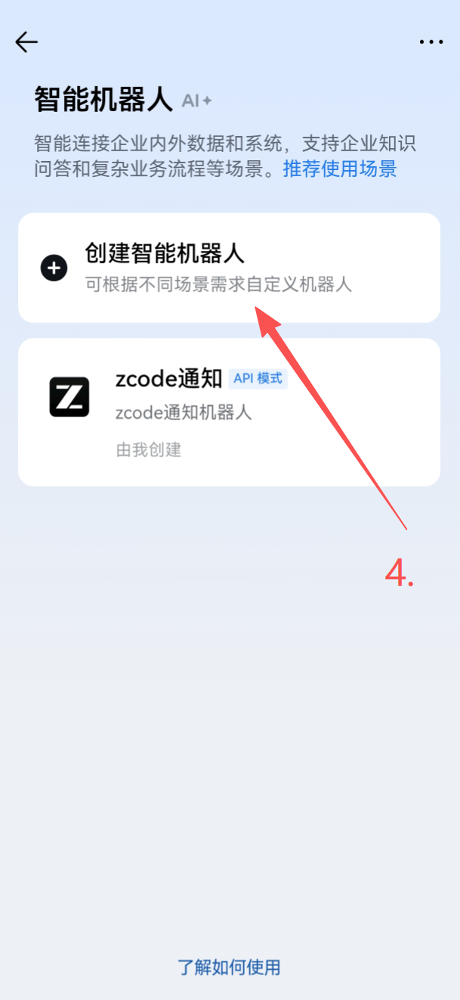
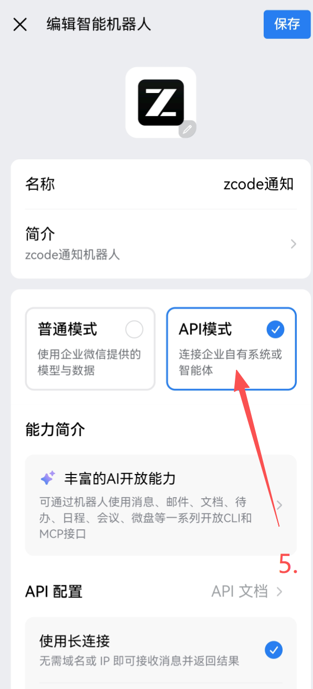
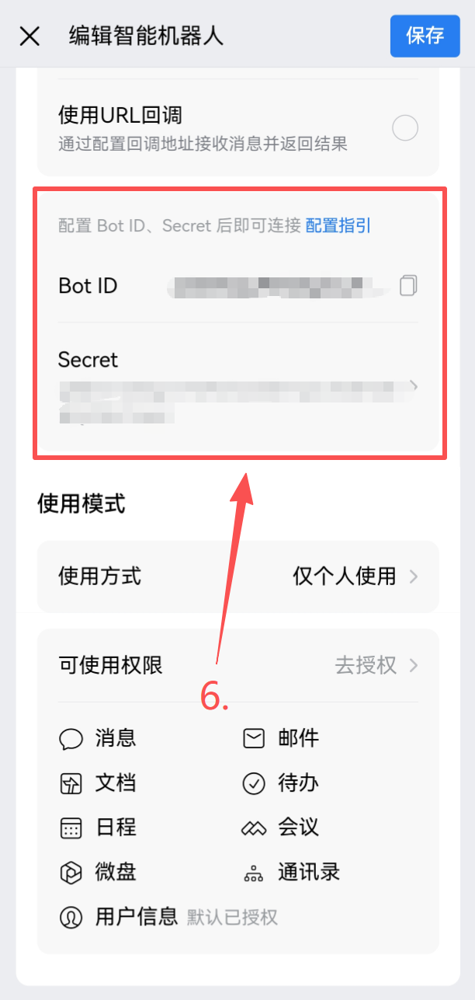

# ZCode Task Notify

给 [ZCode](https://bigmodel.cn/glm-coding) 桌面端加上**企业微信任务通知**：任何会话的任务完成、出错、需要确认时，你的手机企业微信自动收到一条带语义摘要的推送。跑长任务不用盯屏幕，人离开电脑也不错过任何节点。

```
✅ 任务完成（耗时 23 分钟）｜项目文档
   报告已生成：共 12 个章节，数据更新至 Q3。
   > 14:20 · sess_xxxxxxxx（会话 ID 截断展示）
```

## 三步装好

1. **拿地址**：手机企业微信 → 群 → 右上角「···」→「消息推送」→ 添加自定义消息推送 → 复制那串 `https://qyapi.weixin.qq.com/cgi-bin/webhook/send?key=…`
   （没有企业微信先注册，个人免费；图文步骤见「[第一步](#第一步获取企业微信-webhook免费约-5-分钟)」，约 5 分钟）
2. **装**：下载本仓库（GitHub 页 `Code → Download ZIP`）解压，**双击 `install.bat`**，按提示把地址粘进去
   —— 装完手机上会立刻收到一条「🩺 安装成功」，说明通道已通
3. **验**：在 ZCode 里**新建一个会话**随便问一句，会话结束时手机收到「✅ 任务完成（耗时 xx）」就成了

> 没装 Python 也能直接双击：`install.bat` 会自动弹出一份中文安装指引。
> 装完遇到任何问题，在仓库目录跑 `python doctor.py`（逐项自检，直接指出哪一步不对；全装好 16 项、未启用手机批准时 14 项，**只要 0 FAIL 就算通过**）。

**更省事：让 AI 帮你装。** 把下面这段整句发给你电脑上的 ZCode（任何能读网页、能跑命令的 agent 都行），它会照仓库里的执行手册装完；需要你做的事（去企业微信拿 webhook）会来问你：

> 帮我在**这台电脑**上装好「ZCode 任务通知」——仓库 `https://github.com/Lyn-Linyanhe/zcode-task-notify`，执行手册是仓库根目录的 `AGENTS.md`（打不开就先 clone 或下载下来再读），
> 按「A. 安装执行手册」执行：装到 `%USERPROFILE%\.zcode\task-notify`，需要我到企业微信建群机器人拿 webhook 再问我，
> 装完跑 `python doctor.py` 自检并告诉我怎么验证、怎么静音、怎么卸载。我的系统是 Windows。

（完整版提示词见 [`docs/agent-prompt.txt`](docs/agent-prompt.txt)；给 agent 的执行手册见 [`AGENTS.md`](AGENTS.md)。）

**想要手机批准/拒绝权限**（可选项）：多做一步创建「智能机器人」，见[进阶章节](#进阶手机批准拒绝可选)；想开 AI 摘要：`python install.py --llm-key "你的key"`。

## 功能

- **三类事件推送**：任务完成 ✅ / 任务出错 ❌ / 等待确认 ⏸️，完成与出错的标题带任务耗时（按本地数据库的回合真实状态区分，取消不推）
- **手机批准/拒绝**（可选）：权限请求推到手机，点「批准/拒绝」按钮直接放行或拦截，人不在电脑前也能处理（企业微信智能机器人长连接，同样免费）
- **LLM 语义摘要**：默认接 GLM-4.5-Flash（免费模型）生成一句话摘要，能理解创作类内容；未配置或调用失败自动回退内置启发式提取
- **长任务心跳**：回合运行超过 30 分钟自动推「⏳ 仍在运行」（按 payload 的 `turnId` 精确盯本轮，见已知坑 9），回合结束自动退出，防误报
- **微信简单指令**：在机器人单聊里发「帮助 / 状态 / 在跑 / 静默 / 静默 30 / 恢复 / 最近」即可查开关、列出正在运行的会话（各已跑多久）、定时静默、回看最近推送（指令只认主人，见已知坑 10；未启用手机批准时改 `state.json`）
- **智能过滤**：微信 Bot 会话不重复推送；子代理会话过滤；推送失败自动重试并落失败日志

## 工作原理

```
ZCode hooks（会话进程启动时加载，Stop/PermissionRequest/UserPromptSubmit）
├─ notify.py        hook 入口：秒回，落盘 payload，分离进程启动 worker
│     └─ push_worker.py
│          ├─ 过滤：开关 / 微信Bot会话 / 子代理会话
│          ├─ 状态：查 turn_usage 表（等回合行落库，上限 stop_status_wait_sec），区分 ✅完成 / ❌出错 / ⏹️已取消(静默)
│          ├─ 摘要：LLM（GLM-4.5-Flash，失败自动回退启发式提取）
│          └─ 推送：智能机器人单聊优先，降级时走企业微信群机器人 webhook（失败重试 1 次，降级消息带 ⚠️ 标注）
└─ heartbeat_spawn.py → heartbeat.py（分离进程，带上 payload 的 turnId）
       └─ 心跳循环：本轮未结束且到间隔 → 推「⏳ 仍在运行」；本轮落库即退出
```

## 环境要求

- Windows 10/11（使用了 Win32 进程枚举与分离进程 API）
- ZCode 桌面端 **3.11.2+**（hooks schema 在此版本验证）
- Python 3.10+（仅标准库，无第三方依赖；**安装时记得勾选 "Add Python to PATH"**）
  —— 没装也没关系：双击 `install.bat` 会自动弹出一份中文指引（下载地址 + 该勾哪一项）
- 手机安装**企业微信 App**（接收通知的终点）
- 一个企业微信群机器人 webhook（免费，获取步骤见下）

## 第一步：获取企业微信 Webhook（免费，约 5 分钟）

> 企业微信 = 腾讯面向企业的办公 App，**个人使用完全免费**：无需营业执照、无需企业认证、无需付费。通知会发到企业微信 App，不是个人微信——这是"不花钱、不限量、不封号"的代价。

**1. 注册并下载企业微信**

- 电脑访问 [work.weixin.qq.com](https://work.weixin.qq.com) 点「立即注册」，或手机应用商店直接搜索「企业微信」下载；
- 注册只需手机号 + 填一个企业名称（个人使用随便填，如「我的通知」），**不需要认证**；
- 注册完成后，在**手机**上登录企业微信 App——通知最终推送到这里。

**2. 建一个群**

- 企业微信 App → 消息页 → 右上角「+」→ 发起群聊；
- 如果提示「至少选择一名成员」（新账号没有同事时常见），先拉一位家人/朋友进群，**建好后把对方移出即可**——群不会因此解散，机器人继续可用。

**3. 添加群机器人，复制 Webhook 地址**

- 入口因企业微信版本而异：旧版在 群 → 右上角「···」→「群机器人」→「添加机器人」→ 新建；新版手机端在 群 → 右上角「···」→「聊天信息」→ **「消息推送」**→「添加自定义消息推送」；
- 命名随意（如「ZCode 通知」）→ 创建/保存后会显示一个 **Webhook 地址**，形如：
  `https://qyapi.weixin.qq.com/cgi-bin/webhook/send?key=xxxxxxxx-xxxx-xxxx`
- 复制它，**这就是安装脚本要填的东西**。

手机端实测路径（2026-09 版企业微信）：

| 群「聊天信息」里的「消息推送」入口 | 「添加自定义消息推送」，点 Webhook 地址复制 |
|---|---|
|  |  |

**4. 先测一下能不能收到（可选但推荐）**

把下面命令里的地址换成你的 webhook，用 Python 执行（UTF-8 编码可靠，中文不会乱码）：

```bash
python -c "import json,urllib.request; req=urllib.request.Request('https://qyapi.weixin.qq.com/cgi-bin/webhook/send?key=你的key', data=json.dumps({'msgtype':'text','text':{'content':'测试消息 from zcode-task-notify'}}).encode('utf-8'), headers={'Content-Type':'application/json'}); print(urllib.request.urlopen(req).read().decode())"
```

手机企业微信收到「测试消息」即通道打通。输出 `{"errcode":0,"errmsg":"ok"}` 同样代表成功。

> ⚠️ Webhook 地址等同「往这个群发消息的钥匙」，**不要发到公开场合**或提交到 git（本仓库的 .gitignore 已排除含 key 的 config.json）。

## 第二步：安装

**最省事**：下载本仓库（GitHub 页 **Code → Download ZIP**，或 `git clone`）解压后，**双击 `install.bat`** —— 它会自检 Python、按提示让你粘贴 webhook，装完立刻往群里发一条测试消息。

命令行等价写法（`install.py` 不带参数就是交互式，想安静点加 `--no-test`）：

```bash
python install.py                                   # 交互式：按提示粘贴 webhook 地址
python install.py --webhook "https://qyapi.weixin.qq.com/cgi-bin/webhook/send?key=你的key"
python install.py --llm-key "xxx.yyy"               # 顺带开启 AI 摘要（可选，见下）
python install.py --aibot --bot-id "aib..." --bot-secret "..."   # 手机批准/拒绝（可选，见进阶）
```

脚本会：生成 `scripts/config.json` 与开关文件、**自动备份并合并** hooks 配置到 `%USERPROFILE%\.zcode\cli\config.json`（只改 `hooks` 键，其他配置和已有的其他 hook 原样保留，并有带时间戳的备份；重复运行不会重复挂载）。**换过目录或重新下载后，重跑一次即可**——它会自动清掉指向旧位置的重复注册（否则两条 hook 同时跑，会出现"通知时有时无"，见已知坑 11）。

**（可选）接入 LLM 摘要**：在 [bigmodel.cn 控制台](https://bigmodel.cn/console/usercenter/apikeys) 创建一个 API Key（免费注册），然后：

```bash
python install.py --llm-key "你的bigmodel key"      # 推荐：一条命令搞定
```

或者手动编辑 `scripts/config.json`（三处都要对）：

```json
{
  "use_llm_summary": true,
  "llm_api_key": "你的bigmodel key（形如 xxx.yyy）",
  "llm_base_url": "https://open.bigmodel.cn/api/paas/v4",
  "llm_model": "glm-4.5-flash"
}
```

## 第三步：验证

安装脚本已经往群里发过一条「🩺 安装成功」（收到就说明**推送通道**通了）；这一步验证的是**自动触发**那一环：

**在 ZCode 里新建一个会话**，随便发一句话。该会话回复结束时，企业微信应收到「✅ 任务完成」推送，长这样（图为 `doctor.py` 的自检测试消息）：



> 为什么必须新建会话：hooks 配置在会话进程启动时加载，改动只对新会话生效（见下方「已知坑」第 1 条）。
> 没收到就看 `notify_log.jsonl`：无记录 = hook 没触发（会话是不是新建的？）；有 `skipped`/`error` 字段 = 按原因对症处理。

## 进阶：手机批准/拒绝（可选）

权限请求发生时，手机企业微信收到一张带「✅ 批准 / ❌ 拒绝」按钮的卡片，点一下即放行或拦截；**100 秒不操作**自动回退到电脑上的正常确认弹窗。

> **你人在电脑前时不会推手机卡片**：键鼠 60 秒内有活动就判定为"在位"，直接走桌面弹窗、零延迟。所以「手机没收到卡片」最常见的原因就是这个——离开电脑一会儿再触发权限请求即可。这个阈值可用 `aibot_config.json` 的 `desk_active_sec` 调整。

基于企业微信「智能机器人」**长连接**（免费、无需公网服务器），与上面的群机器人通知互相独立、互不影响。

**第一步：创建智能机器人**（手机企业微信，约 2 分钟）

1. 底部「**通讯录**」→ 顶部「**智能机器人**」→ 右上角「**创建**」→「**创建智能机器人**」：

| 1+2. 通讯录 → 智能机器人 | 3. 右上角「创建」 | 4. 创建智能机器人 |
|---|---|---|
|  |  |  |

2. 在配置页选 **API 模式** + **使用长连接** → 点「随机获取」生成 Secret → **保存**；进入 机器人详情 → **API设置** 复制 Bot ID 和 Secret：

| 5. API 模式 + 长连接 | 6. 复制 Bot ID / Secret |
|---|---|
|  |  |

**第二步：装到电脑上**

```bash
python install.py --aibot --bot-id "aib..." --bot-secret "..."
```

（如果通知部分还没装，可以一次装完：`python install.py --webhook "https://...key=你的key" --aibot --bot-id "aib..." --bot-secret "..."`）

**第三步：激活**——给这个机器人**发一条单聊消息**（如"你好"），连接器自动捕获你的推送地址并就绪。

之后在单聊里发「帮助 / 状态 / 在跑 / 静默 / 静默 30 / 恢复 / 最近」就能遥控通知系统。**这里只做轻量指令**（查状态、列出正在运行的会话、开关通知、回看推送）；真正要 agent 干活的任务，请打开手机远程控制页面看它具体怎么执行。

> 「在跑」的判据是**心跳进程存活**（每个会话提交消息时会拉起一个心跳，回合结束即退出）——所以只有在本功能上线后**提交过至少一次消息**的会话才会出现在列表里，之前已在跑的老会话看不到。

运行机制：权限请求 → hook 经本地连接器（`127.0.0.1:17899`）发卡片（**标题带会话名**，如「写周报 · 请求确认」，通知预览里一眼可辨）→ 你点按钮 → 决定回写给 hook → ZCode 继续/停止，卡片同时原位变成结果卡并锁定（标题保留、决定挪到副标题行）。连接器由心跳 hook 看门狗守护（发消息时自动拉起），断线由 SDK 自动重连。安全边界：卡片只发你自己的单聊；决定文件仅存本地且 15 分钟过期；webhook 通知与按钮决策互为降级（连接器不在线时自动退回普通 ⏸️ 通知）。

> 卡片决策同样只对**新会话**生效（见已知坑 1）。

**统一通知通道（启用手机批准后）**：所有通知（✅❌⏸️⏳）自动优先走智能机器人单聊（一个消息来源，干净），连接器不在线时**自动降级**回群 webhook，通知永不静默丢失。

降级时消息末尾会自带一行提示（形如 `> ⚠️ 通道降级：智能机器人不可用（连接器离线），本条由群机器人代发…`），写明原因（未配置 / 未绑定用户 / 连接器离线 / 连接器拒绝），并提醒**群机器人只能单向通知、回复指令或点按钮无效**——所以"看到降级提示"本身就是报警，不用另设监控。未启用 aibot 的用户行为不变（纯 webhook）。

## 配置项（`scripts/config.json`）

| 键 | 默认 | 说明 |
|---|---|---|
| `webhook` | 必填 | 企业微信群机器人地址 |
| `use_llm_summary` | `false` | 开启 LLM 语义摘要（失败自动回退启发式） |
| `llm_api_format` | `openai` | `openai`（bigmodel v4）或 `anthropic` |
| `llm_model` | `glm-4.5-flash` | 摘要模型（免费） |
| `llm_timeout_sec` | `10` | 摘要请求超时（秒）；超时就回退启发式摘要，不拖慢通知本身 |
| `heartbeat_interval_min` | `30` | 心跳间隔（分钟） |
| `heartbeat_max_hours` | `4` | 心跳最长跟踪时长（小时） |
| `stop_status_wait_sec` | `60` | 回合结束后最多等多少秒让 `turn_usage` 行落库（拿到耗时与真实状态；见已知坑 5） |

开关：`scripts/state.json` 的 `enabled` 字段（`true`/`false`）；启用手机批准（见进阶章节）后，直接给机器人发「静默」「静默 30」「恢复」「状态」即可遥控开关——「静默 30」是**定时静默**，到点自动恢复（由读取方按时钟判断，不需要额外常驻进程）。

## 自检与卸载

收不到通知时，一条命令定位问题（逐项检查：Python 版本 / 桌面端运行 / 开关 / webhook 配置与通道实测 / hooks 注册 / 顶层键毒化 / 脚本完整性 / LLM key / aibot 手机批准组件；全装好 16 项，未启用手机批准时 14 项）：

```bash
python doctor.py                 # 含企业微信通道实测（会发一条测试消息）
python doctor.py --no-send       # 静默检查，不发测试消息
```

卸载（移除本工具注册的 hooks，保留其他配置和已有 hook，并自动备份）：

```bash
python install.py --uninstall
```

之后删除仓库目录即可（无残留、无系统级安装）。若 `--uninstall` 不可用（比如手动改过配置），备选方案：

1. 用 `%USERPROFILE%\.zcode\cli\config.json` 旁的备份文件（`config.json.bak-<时间戳>`）覆盖回去，或手动把 `hooks.events` 里 `args` 指向本工具 `scripts` 的条目删掉；
2. （可选）进入企业微信群 → 群机器人/消息推送 → 移除机器人。

安装时也可加 `--test` 让脚本装完立即发一条测试消息验证通道。

## 已知坑与设计决策（实测踩出来的，重要）

1. **hooks 配置在会话的 agent 进程启动时读取一次，进程存活期不重读**。改配置后新会话立即生效，已启动的会话要等 ZCode 重启。测试新配置务必开全新会话，在老会话里测会得出"不生效"的错误结论。
2. **`~/.zcode/cli/config.json` 对顶层键严格校验**：放入 hooks 以外的未知顶层键（如 `provider`）会导致 hooks 配置整体静默失效——没有任何报错，就是不执行（2026-09-14 实测复发：桌面端写入模型设置时把 `provider` 写回该文件顶层，重启后 hook 全部消失）。现已内置两级防护：`doctor.py` 第 13 项会检查毒键；**自愈机制**——每次用户提交消息时心跳 hook 检测到已知毒键会自动备份（`config.json.bak-*-selfheal`）、移除并推送「🔧 hooks 配置自愈」告知。该文件只应有 `plugins`、`hooks` 等官方键。
3. **glm-4.5-flash 是思考模型**：v4 接口请求必须带 `"thinking": {"type": "disabled"}`，否则思考链吃光 `max_tokens`、正文为空且容易超时。
4. **zcode-plan 端点（`zcode.z.ai/api/v1/zcode-plan/*`）有 captcha 防护**，脚本直调会返回 `{"code":3007,"msg":"captcha verify failed"}`——该通道仅限桌面端内部使用，外部脚本应走 open.bigmodel.cn 标准 v4 接口。
5. **Stop hook 的 payload 没有成功/失败标志**，需按 `turnId` 查本地 `turn_usage` 表获取真实状态（`completed/error/cancelled`）。**而且那一行是回合彻底结束后才整体写入的**：Stop hook 触发的瞬间它通常还不存在（`duration_ms`、`error_code` 同批写入）。所以查询必须"等行出现"——只判 `status == "running"` 会在行缺失时一次都不等就返回，后果是**耗时永远为空、出错永远显示 ✅、取消永远不跳过**（2026-09-14 实测 46 条推送无一例外，同日修复）。等待上限由 `stop_status_wait_sec` 控制，取不到就降级为"无耗时"照常推送，绝不因为查不到而丢通知；每次判定都写进 `notify_log.jsonl` 的 `turn_status`/`duration_ms`/`waited_s` 字段备查。
6. 企业微信**群机器人 webhook 是单向通道**（通知只能看不能点）；双向交互（手机批准/拒绝）走的是另一条通道——智能机器人长连接（见「进阶：手机批准/拒绝」），两者互不影响。
7. **智能机器人长连接没有 `text` 消息类型**：连"一次性回复"也必须用流式结构 `{"msgtype":"stream","stream":{"id":…,"finish":true,"content":…}}`（SDK 里即 `ws.reply_stream(...)`）。写成 `{"msgtype":"text",…}` 会被拒 `40008 invalid message type`，现象是**「静默/恢复/状态」收到了但机器人不回话**——入站日志 `aibot_cmd` 有记录，紧跟一条 40008。v1.2.2 已修。
8. **卡片原位更新必须保持 `card_type=button_interaction`**：想换成 `text_notice` 会报 `42045 Template_Card card_action Missing or Invalid`，卡片纹丝不动。代价是结果卡上的按钮**依然可以再点**，所以 `on_card_click` 做了幂等——同一 `task_id` 只认第一次决定，重复点击只留一条 `decision_dup` 日志。另外决定文件有 **15 分钟 TTL**（`cleanup_decisions`），隔很久再点旧卡会被当成新决定。
9. **长任务心跳必须盯 payload 里的 `turnId` 那一行，不能看"该会话最新一行"**：因为行是回合结束后才写入的（见坑 5），"最新一行"永远是**上一个已结束的回合**，于是心跳每次启动都秒退——长任务提醒形同虚设（2026-09-14 实测 52 次启动、45 次秒退、⏳ 推送 0 次）。正确判据是：**该 turnId 的行不存在 = 本轮还在跑**（起点用心跳自己的启动时刻），行出现且终态 = 结束。另注意 ⏳ 必须**先等满一个间隔再推**，否则每条消息都会立刻收到一条"仍在运行"。
10. **微信指令只认主人**：连接器会把发送者的 `userid` 与 `aibot_config.json` 里的 `target_userid` 比对，不一致的指令只记一条 `aibot_cmd_ignored` 日志，既不回复也不执行（要能"做事"，鉴权必须先立住）。尚未绑定主人时只接受**单聊**里的第一位发送者——群聊无法确认归属，一律先拒，避免被陌生人抢绑。所以新装机请先用本人账号在单聊里发一句话完成绑定。
11. **hooks 里记的是脚本的绝对路径**，所以仓库目录被挪走或重新下载到别处后，旧注册会变成"指向不存在文件"的死条目；更隐蔽的情况是旧目录还在，于是**两条 hook 同时跑**——一条推送正常、另一条静默失败，现象是"通知时有时无 + 失败日志莫名增多"。重跑一次 `python install.py`（或双击 `install.bat`）即可自动清掉指向旧位置的注册，不用手改配置。
12. **卡片按钮的文字预算只有约 2 个汉字**（2026-09-15 实测三按钮卡）：写「🅰 继续收尾」会被截成「A…」。所以多选卡的**完整选项文本放描述行**（`sub_title_text` 空间充裕），按钮只放 `A/B/C` 短标签，点击回流后由连接器按 task_id 存的映射还原成完整文案。**原位更新是整卡替换**：结果卡不带回原标题的话，会话名就丢了——所以发卡时的标题记在连接器内存（`TASK_META`），更新时拼回去（决定文案挪到 desc 行）。微信通知预览/聊天列表只显示标题行，所以**会话名必须在标题里**，放正文等于没有。

## 故障排查

| 现象 | 排查 |
|---|---|
| 完全收不到推送 | 看 `notify_log.jsonl`：无记录=hook 未触发（确认会话是新建的）；有记录=看 `skipped`/`error` 原因 |
| 推送时有时无 | 确认触发会话是在 hooks 配置写入**之后**启动的（见坑 1） |
| `push_failures.log` 有内容 | 企业微信侧问题：webhook key 是否被重置、网络是否可达 |
| LLM 摘要没生效 | 看 `notify_log.jsonl` 的 `llm_error`；确认 `llm_api_key` 有效、未超免费限速 |
| 权限卡片没推到手机 | ① **人在电脑前就不会推**（键鼠 60 秒内有活动即走桌面弹窗，见「进阶」章节）；② 确认给机器人发过一条单聊消息（`notify_log.jsonl` 应有 `target_captured`，或 `doctor.py` 第 16 项"连接器在线"为 PASS）；③ 查 `notify_log.jsonl` 有没有 `card_sent`——没有说明连接器不在线，此时会自动降级成 ⏸️ webhook 通知 |
| 给机器人发指令（帮助/静默/状态/最近）没反应 | ① 确认是用**本人账号**发的（指令只认主人，见坑 10；换号发的只留 `aibot_cmd_ignored` 日志）；② 查 `notify_log.jsonl`：有 `aibot_cmd` 但紧跟 `errmsg=invalid message type`/`40008` = 回复格式问题（见坑 7，升到 v1.2.2 即修）；连 `aibot_cmd` 都没有 = 消息没进来（确认机器人在线、且消息发给了这个机器人） |
| 通知标题里没有耗时 | 看 `notify_log.jsonl` 里该条的 `turn_status` / `duration_ms` / `waited_s`：`duration_ms` 为 `null` = 等满 `stop_status_wait_sec` 行仍未落库（可调大该值）；`duration_ms` 有值但不足 10 秒 = 刻意不标（见坑 5） |
| 推送末尾出现「⚠️ 通道降级」 | 这是设计内的报警：智能机器人不可用，括号里写了原因（未配置/未绑定用户/连接器离线/连接器拒绝）。此时消息由群机器人代发，**回复指令和点卡片按钮都无效**；按进阶章节把连接器恢复即可 |
| 长任务跑很久也没收到 ⏳ | 看 `heartbeat_log.jsonl`：`start` 后紧跟 `exit: "turn finished"` = 把本轮误判成已结束（见坑 9）；`no turn id in payload` = 这次提交流程没带回合号（心跳宁可不推）；`another heartbeat running` = 同会话已有心跳在跟踪，属正常去重 |

## License

[MIT](LICENSE)
